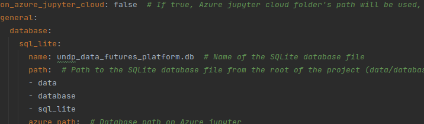
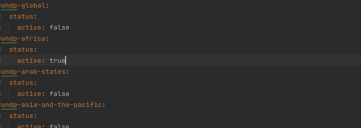
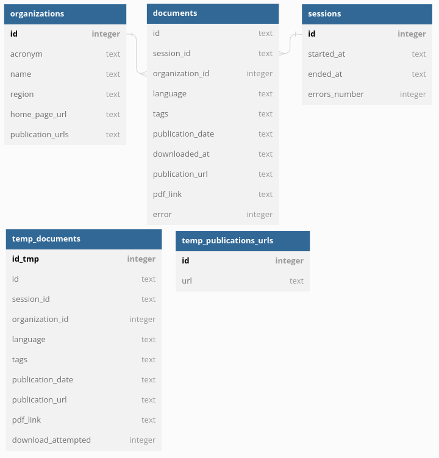

# dsc-igo-scraper
Web-scraping pipelines to collect publications from websites of intergovernmental organisations.

The New Data Futures Platform Pipeline is a Python-based data processing pipeline designed to automate the downloading 
and processing of PDF files from various organizations' websites. This program serves as the central hub for 
executing and managing the pipeline.

## List of supported organizations

<table style="height: 600px; text-align: center">
    <tr style="height: 45px">
        <td align="center">
            <a href="https://www.undp.org/">
                
                <br>
                UNDP
            </a>
        </td>
        <td align="center">
            <a href="https://www.who.int/">
                
                <br>
                WHO
            </a>
        </td>
        <td align="center">
            <a href="https://www.un.org/">
                
                <br>
                UN
            </a>
        </td>
        <td align="center">
            <a href="https://www.worldbank.org/">
                
                <br>
                World Bank
            </a>
        </td>
        <td align="center">
            <a href="https://www.unicef.org/">
                
                <br>
                UNICEF
            </a>
        </td>
        <td align="center">
            <a href="http://www.unep.org/">
                
                <br>
                UNEP
            </a>
        </td>
    </tr>
    <tr>
        <td align="center">
            <a href="https://www.wfp.org/">
                
                <br>
                WFP
            </a>
        </td>
        <td align="center">
            <a href="https://www.unhabitat.org/">
                
                <br>
                UN-Habitat
            </a>
        </td>
        <td align="center">
            <a href="https://www.unwto.org/">
                
                <br>
                UNWTO
            </a>
        </td>
        <td align="center">
            <a href="https://www.ilo.org/">
                
                <br>
                ILO
            </a>
        </td>
        <td align="center">
            <a href="http://www.uncdf.org/">
                
                <br>
                UNCDF
            </a>
        </td>
        <td align="center">
            <a href="http://www.wipo.int/">
                
                <br>
                WIPO
            </a>
        </td>
    </tr>
</table>

## Getting Started
* Clone the current repository:
```commandline
git clone git@github.com:UNDP-Data/dsc-igo-scraper.git
```
* Install packages in the `requirements.txt` file: With package manager `pip`, run at the root of the project the command:
```commandline
pip install -r requirements.txt
```
* Adjust the parameters in the `config.json` file if needed. In the following screenshot, the name of the sqlite database is `undp_data_futures_platform.db` and it is stored at the relative path `data/database/sql_lite` (for Unix-based systems). 

* In the file `scrapers_register.yaml` set to `TRUE` the `active` status of the websites you want to download the publications. In below screenshot, data will be downloaded from only the UNDP's Africa regional website.

* Run the main file and wait for the program to finish downloading the documents:
```commandline
python main.py
```

## Key Features

#### Web Scraping
The pipeline utilizes web scraping techniques to extract PDF files from different organizations' 
websites. It leverages Python libraries such as `BeautifulSoup`, `Selenium` and `requests` to navigate web pages, 
identify relevant PDF links, and initiate the download process.

#### File Downloading
Once the PDF links are obtained, the pipeline automatically downloads the files from the respective 
websites. It employs the `requests` library to efficiently retrieve the files and save them to the local file system.
The `concurrent downloads` feature can be activated in the `config` file by setting the key `allow_parallel_downloads` to `true` and setting the maximum number of concurrent downloads in the key `max_concurrent_downloads`.

#### Database Storage
The metadata of each document is stored in an SQLite database consisting of five tables: 
`organizations`, `documents`, `sessions`, `temp_publications_urls`, and `temp_documents_table`.
* Table `organizations`: 
This table stores information about UN-related organizations of interest. Each entry represents an organization, 
including its global or regional affiliation, acronym, and a comma-separated list of publication URLs associated 
with the organization. It also contains details about the last web scraping session performed on the organization's 
publication URLs, such as the session ID, date of the session, the number of newly downloaded PDFs, and the current 
count of total downloaded publication PDFs.
* Table `documents`:
The `documents` table maintains a record of all downloaded PDFs. Each entry includes an auto-incremented ID, 
the session ID during which the PDF was downloaded, a publication ID generated based on the publication's title, 
the acronym of the organization, its region, and the language. It also stores tags or topics associated with the 
publication (separated by semicolons), the publication date, the date of the download, the download link, and 
an error field indicating whether the download was successful (0) or encountered an error (1).
* Table `sessions`:
This table provides a summary of all web scraping sessions. It includes information such as the 
session ID (represented as session_id), which is a timestamp in UTC+0 format, the date of the session, 
the total number of publication links retrieved during the session, and the total number of 
downloaded PDFs associated with that session.
* Table `temp_publications_urls`:
This temporary table stores all URLs collected for one organization. It is reset (all existing rows are removed and 
autoincrement ID is set back to 0) every time a web scraping process starts for an organization. Publication URLs are 
collected and inserted into the temp_publications_urls table for the ongoing web scraping process.

* Table `temp_documents_table`:
This table temporarily stores details on the PDFs that need to be downloaded for a specific organization. It is similar 
to the main table documents, but like temp_publications_urls, it is also reset every time a web scraping process starts 
for the corresponding organization. The table is then populated again with new PDF details collected through the URLs 
from temp_publications_urls.

Note: The temporary tables, in conjunction with the values `max_publication_urls_chunk_size` and 
`max_document_links_chunk_size` in the `config.json` file, aim to optimize memory usage. They allow for efficient 
handling of data in chunks, facilitating memory management during the web scraping process.

The bellow image is the representation of the database schema.


